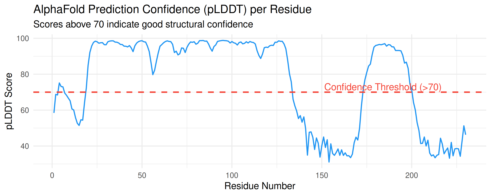
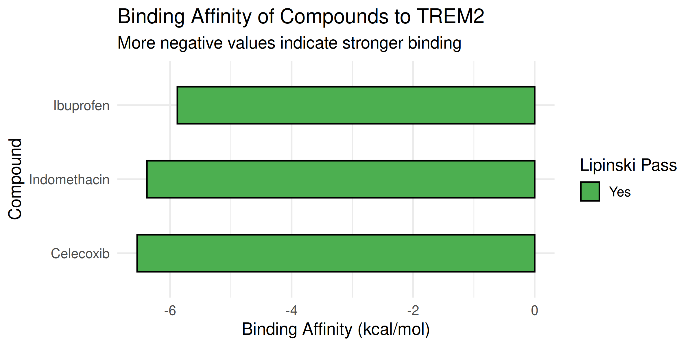

# AlphaFold CADD Workflow: TREM2 Target

This repository demonstrates a fully automated Computer-Aided Drug Design (CADD) pipeline, connecting structural biology predictions with virtual screening workflows. This repo connects directly to the concepts covered in the EMBL-EBI AlphaFold course, integrating them with practical computational chemistry skills.

## Scientific Question
*Which of these known compounds (Celecoxib, Indomethacin, Ibuprofen) shows the strongest predicted binding affinity for the TREM2 target using an AlphaFold-predicted structure?*

## Workflow and Methodology
1. **Protein Preparation**: Protein structure was predicted using AlphaFold (via ColabFold). Rank 1 model was selected.
2. **Confidence Analysis**: Extracted pLDDT scores per residue and visualized them using R (`ggplot2`).
3. **Molecular Docking**: Conducted virtual screening of the selected ligands against the receptor using AutoDock Vina.
4. **Filtering**: Applied Lipinski's Rule of Five screening via Python (`pandas`, `RDKit`/cheminformatics logic).
5. **Visualization**: Binding affinities and filter results were plotted using R (`ggplot2`).
6. **Nextflow Automation**: Scaled the workflow using Nextflow (DSL2) for parallel processing and automated Python log extraction.

## Results
Based on the docking simulation, **Celecoxib** demonstrated the strongest predicted binding affinity (-6.541 kcal/mol) and successfully passed the Lipinski filter.

### Visualizations

#### 1. AlphaFold Model Confidence (pLDDT Score)


#### 2. Virtual Screening Summary


## Scientific Disclaimer
This is a portfolio project utilizing publicly available computational tools. Computational predictions of binding affinity (*in silico*) serve as an initial filter to prioritize compounds. These results do not guarantee biological activity and require rigorous experimental validation (*in vitro* and *in vivo*) to confirm actual therapeutic efficacy.

## References
* **AlphaFold**: Jumper, J., Evans, R., Pritzel, A. et al. Highly accurate protein structure prediction with AlphaFold. *Nature* 596, 583–589 (2021).
* **ColabFold**: Mirdita, M., Schütze, K., Moriwaki, Y. et al. ColabFold: making protein folding accessible to all. *Nature Methods* 19, 679–682 (2022).
* **AutoDock Vina**: Trott, O., & Olson, A. J. AutoDock Vina: improving the speed and accuracy of docking with a new scoring function. *Journal of computational chemistry*, 31(2), 455-461 (2010).

```mermaid
graph TD
    A[data/*.pdb Receptors] --> C(PREP_AND_DOCK Process)
    B[data/*.sdf Ligands] --> C
    C --> D[results/nextflow_output/docking_results]
    C --> E[Raw Vina Logs]
    E --> F(ANALYZE_RESULTS Process)
    F --> G[results/nextflow_output/analysis/binding_affinities_summary.csv]
    
    style C fill:#4CAF50,stroke:#333,stroke-width:2px
    style F fill:#2196F3,stroke:#333,stroke-width:2px
